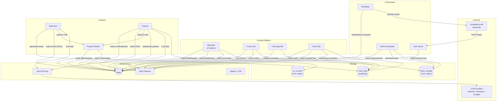
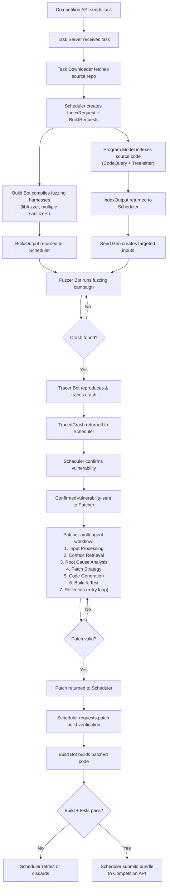
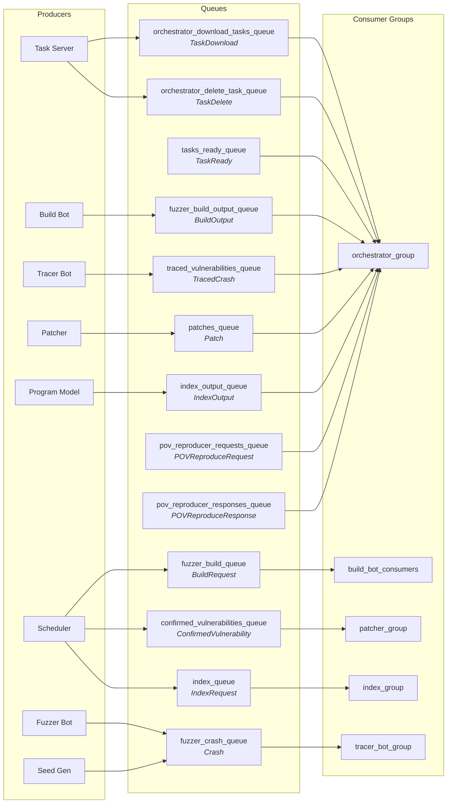
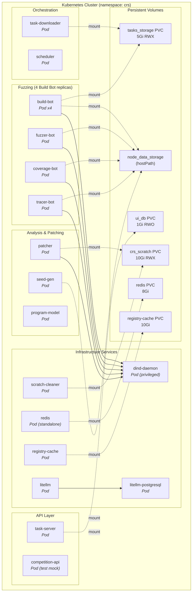

# Buttercup Architecture

This document provides visual diagrams of the Buttercup CRS architecture, covering the high-level system design, data flow, message queue topology, and Kubernetes deployment layout.

## System Architecture

The following diagram shows all major components and how they communicate. The **Orchestrator** (task-server, downloader, scheduler) coordinates the overall workflow. **Redis** serves as the central message broker. **LiteLLM** proxies all LLM calls for the patcher and seed-gen components.

## Data Flow

This diagram traces the lifecycle of a vulnerability challenge from initial download through patching and submission.

## Redis Queue Topology

All inter-service communication flows through Redis Streams with consumer groups for reliable, at-least-once delivery. Each queue carries protobuf-serialized messages.

### Queue Summary Table

| Queue | Message Type | Producer(s) | Consumer Group |
|-------|-------------|-------------|----------------|
| `orchestrator_download_tasks_queue` | TaskDownload | Task Server | orchestrator_group |
| `orchestrator_delete_task_queue` | TaskDelete | Task Server | orchestrator_group |
| `tasks_ready_queue` | TaskReady | Downloader | orchestrator_group |
| `fuzzer_build_queue` | BuildRequest | Scheduler | build_bot_consumers |
| `fuzzer_build_output_queue` | BuildOutput | Build Bot | orchestrator_group |
| `fuzzer_crash_queue` | Crash | Fuzzer Bot, Seed Gen | tracer_bot_group |
| `traced_vulnerabilities_queue` | TracedCrash | Tracer Bot | orchestrator_group |
| `confirmed_vulnerabilities_queue` | ConfirmedVulnerability | Scheduler | patcher_group |
| `patches_queue` | Patch | Patcher | orchestrator_group |
| `index_queue` | IndexRequest | Scheduler | index_group |
| `index_output_queue` | IndexOutput | Program Model | orchestrator_group |
| `pov_reproducer_requests_queue` | POVReproduceRequest | Scheduler | orchestrator_group |
| `pov_reproducer_responses_queue` | POVReproduceResponse | Fuzzer Bot | orchestrator_group |

## Deployment Topology

All services run as pods in the `crs` Kubernetes namespace. Shared volumes provide cross-pod access to task data and scratch space.

### Container Images

| Service | Image |
|---------|-------|
| Orchestrator (task-server, downloader, scheduler) | `ghcr.io/trailofbits/buttercup/buttercup-orchestrator` |
| Fuzzer (build-bot, fuzzer-bot, coverage-bot, tracer-bot) | `ghcr.io/trailofbits/buttercup/buttercup-fuzzer` |
| Patcher | `ghcr.io/trailofbits/buttercup/buttercup-patcher` |
| Seed Gen | `ghcr.io/trailofbits/buttercup/buttercup-seed-gen` |
| Program Model | `ghcr.io/trailofbits/buttercup/buttercup-program-model` |
| Competition API (test) | `ghcr.io/tob-challenges/example-crs-architecture/competition-test-api` |
